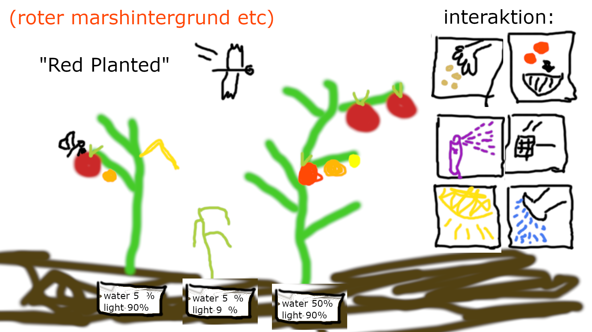
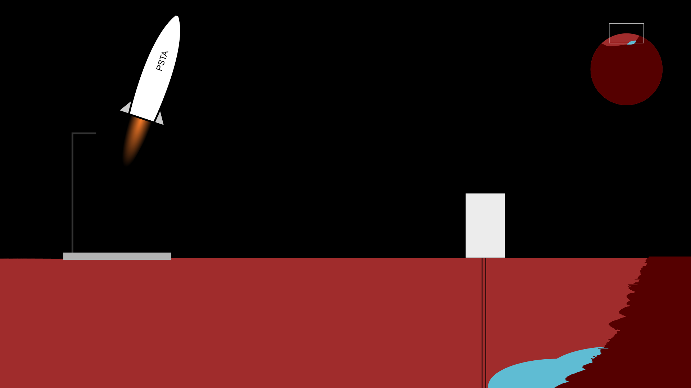

# Init Discussion

Agenda
1. Kurze Vorstellungsrunde
1. Diskussion Modus
1. Brainstorming

## Kurze Vorstellungsrunde

*Wer sind wir und was stellen wir uns vor?*

* Wie heißt du?
* Was erwartest/erhoffst du dir?
* Wieviel Zeit möchtest/kannst du investieren?
* Was ist dein Ziel für heute?

Marion
Hoffnung, dass was raus kommt das funktioniert und, dass die gemeinsame Zusammenarbeit klappt; wir müssen nicht gewinnen
Circa zwei Stunden pro Tag
Gemeinsam eine Idee finden, wer macht was, ...

Paul, Hintergrund Physik, jetzt Python Software Dev
Wäre schon cool, wenn nachher was funtkioniert, finde es cool mit motivierten Leuten zusammen zu arbeiten, bisschen was lernen (wie machen das andere)
Montag, Freitag, Samstag hätte Zeit; sonst abends vielleicht eine halbe Stunde (zw. 8 und 21 Uhr)
Idee einigen damit wir wissen, wer was tun könnte (für vieles offen, wenig Idee von Grafik oä)

Christian, Chemiker, noch PhD, Python Hobby, Automatisierung in Chemie mit Python
Ein nettes Spiel zusammen bringen, erwarte nicht, dass wir gewinnen
3-4 Stunden am Abend (wenn motiviert auch mehr ;)
Spieltype (Jump n Run, Strategie, Puzzle, ...), wie interpretieren wir Red Planet

Claus
TODO

Christoph
* Gemeinsam an einem Projekt arbeiten und dabei etwas lernen wobei bestenfalls etwas rauskommt was Spaß beim dran tüffteln macht. Die Endplatzierung ist mir ganz egal
* Ich kann ungefähr 2h am Tag investieren
* Ein einfaches Konzept zu finden das wir bis zum Ende bringen können.

thp
https://thp.io/

## Diskussion Modus & Organisation

*Wie wollen wir zusammen arbeiten?*

* Diskussion über Issues: Passt das für alle oder brauchen wir einen anderen Kanal?
  * Klappt gut. Ab jetzt alles über Issues, bei Bedarf TBD
* Ich (Claus) würde was wir hier besprechen dann im Repo ablegen. Okay?
  * Jep
* Wollen wir eine Zeitplan? TODO
* ...

## Brainstorming

*Was haben wir für Ideen?*

Siehe https://github.com/PyUGAT/pyweek34/issues/2.

Haben wir eine Idee, die man erweitern kann?

### DISCARDED: Tomatoe vs Fruit Flies |

Tomatoe (red planet) is populated by fruit flies.
Player has to get rid off the flies.
Player gets scores for every fly.

### Angry Planet ("You are the good guy") |||

The planet is polluted by cars and roads (growing like a mushroom).
Player has to prevent the spread to save the planet.
Ziel ist es, die Ausbreitung zu verhindern.

TODO: Interaction?
- Strategy?
- Jump and run?

Can be framed as [tower defense](https://de.wikipedia.org/wiki/Tower_Defense) where
the player defends a region (e.g. lake) against the street network and cars.

### DISCARDED: Angry Planet ("You are the bad guy") |

Spieler ist der "polluter", der Planet wehrt sich.
Planet wehrt sich mit Naturkatastrophen.
Ziel ist ein High Score.

### DISCARDED: The Martian

Aufbauspiel

Interaktionen:

 - Anfang: Man landet und die Kollegen lassen ihn zurück
 - Kartoffeln und Gemüsen anbauen
 - irgendwas schlimmes passiert
 - Mit dem Mars-Rover herumfahren
 - Checkpoints/Goals, zB Nahrung beschaffen, Funkgerät bauen, Energiebeschaffung
 - Ziel: Man wird von Leuten wieder abgeholt (oder man kann mit einem Raumschiff zurück)

### Garten Simulator am Mars |||

 - Sachen anbauen
 - für Bewässerung sorgen
 - sich gegen Fruchtfliegen wehren
 - Ziel: Genug Nahrung, damit man seine Reise antreten kann

...

 - Kurz angerissenes Implementation Detail: Prozedural generierte Pflanzen (+prozedural animiert)

### Mars Station and Terraforming |||

 - Wir müssen auf den Mars
 - Beginnen auf einem Raumhafen, Transport von Rohstoffen zu/von Erde
 - Antagonisten Meteoriten und Marsmännchen
 - Muss Infrastruktur bauen um Rohstoffe abzubauen
 - Gibt Marsrover die "ernten"

## Allgemeine Notizen

Notizen/Breadcrumbs im Repo hinterlassen.

Vergangene Beiträge: https://pyug.at/PyWeek

https://s3.eu-west-2.amazonaws.com/media.pyweek.org/32/mary-go-round/mary-go-round.zip

https://github.com/thp/pyweek15/tree/master/engine

https://github.com/thp/pyweek31 (pygame zero)
- https://github.com/thp/pyweek31/blob/master/cops.py

## Entscheidung: Red Planted

Spiel in Echtzeit

Es gibt Interaktionen
* Säen
* Gießen
* Sonne
* Fliegenklatsche
* Spray
* Ernten

Man pflanzt Tomaten, diese werden von Fliegne befallen und müssen
geschützt werden.
Es gibt eine Zoom-Ansicht.
Das Beet ist ein Kreissektor auf dem Planeten.
Fruchtfliegen mit Raumfahrthelm?

## Kommentare
* Wir nehmen pygame
* black ist okay
* Daily jeden Tag um 20:00
* Gibt ein allgemeines Update Issue mit allgemeinem Zeug
